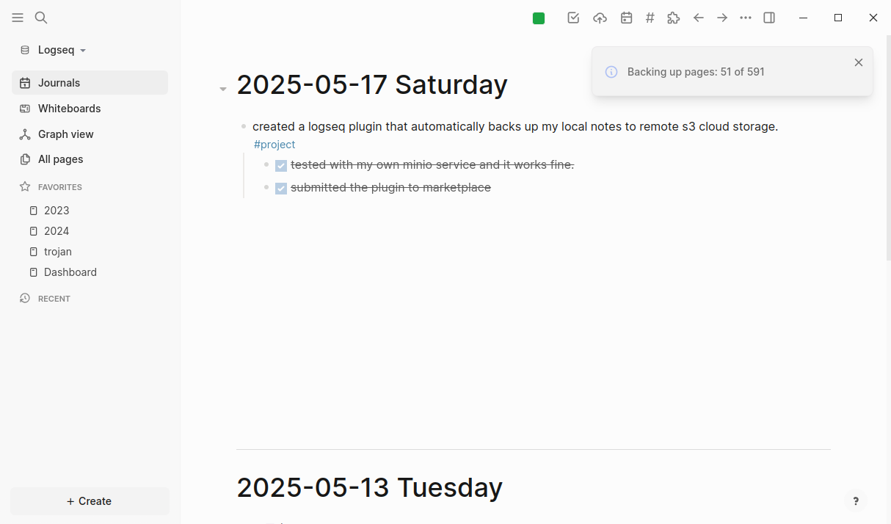

# Logseq Super Sync


A Logseq plugin for automatic page backup and synchronization with cloud storage services.



## Features

- [x] **S3 Cloud Backup**
  - Automatically backup to AWS S3 or any S3-compatible service (MinIO, DigitalOcean Spaces, etc.)
  - Intelligent file diff detection to avoid redundant uploads
  - Maintains original file structure (journals/pages directory hierarchy)

- [x] **Automatic Sync Options**
  - Real-time backup after changes (with intelligent debouncing)
  - One-click manual backup through toolbar button
  - Slash command support (`/Backup All Pages`)

- [ ] **Git**
- [ ] **WebDAV**
- [ ] **Local filesystem backup**
- [ ] **Restore functionality**
- [ ] **Conflict resolution**

## Installation

### From Marketplace (Recommended)

1. Open Logseq
2. Click on the "..." menu in the top-right corner
3. Select "Plugins"
4. Find "Super Sync" in the marketplace and click "Install"

### Manual Installation

1. Download the latest release ZIP file from [GitHub Releases](https://github.com/your-username/logseq-super-sync/releases/latest)
2. Extract the ZIP file
3. In Logseq, go to Settings > Features > Advanced > Developer mode
4. Click on "Load unpacked plugin"
5. Select the extracted directory

## Configuration

1. Open Logseq Settings
2. Navigate to the "Super Sync" plugin settings
3. Configure your preferred backup provider:

### S3 Configuration

- **Bucket Name**: Name of your S3 bucket
- **Region**: AWS region (e.g., `us-east-1`)
- **Access Key ID**: Your AWS access key ID
- **Secret Access Key**: Your AWS secret access key
- **Path Prefix** (optional): Folder path within the bucket (e.g., `logseq-backup/`)
- **Custom Endpoint** (optional): For S3-compatible services like MinIO

## Usage

### Toolbar Button

Click the cloud upload icon (📤) in the toolbar to start a full backup.

### Slash Commands

Type `/Backup All Pages` in the editor to trigger a full backup.

### Automatic Backup

Pages are automatically backed up after changes when the "Enable automatic backup" setting is turned on.

## Development

1. Clone this repository
2. Install dependencies:
   ```bash
   npm install
   ```
3. Run development server:
   ```bash
   npm run dev
   ```
4. Build for production:
   ```bash
   npm run build
   ```

## License

MIT
